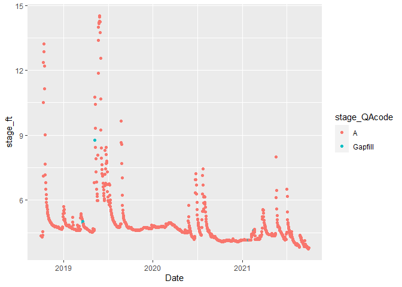

EEEEEEEEE testing
================
Muhaha

Workflow to :

1.  Prepare R environment
2.  Download data
3.  Tidy and gap filling data
4.  Summary statistics report

## 1. Prepare R environment

Load relevant packages

``` r
knitr::opts_chunk$set(echo=TRUE) #all code chunks will be shown in final file
library (dataRetrieval)
```

    ## Warning: package 'dataRetrieval' was built under R version 4.0.5

``` r
library (tidyverse)
```

    ## Warning: package 'tidyverse' was built under R version 4.0.5

    ## -- Attaching packages --------------------------------------- tidyverse 1.3.1 --

    ## v ggplot2 3.3.5     v purrr   0.3.4
    ## v tibble  3.1.6     v dplyr   1.0.8
    ## v tidyr   1.2.0     v stringr 1.4.0
    ## v readr   2.1.2     v forcats 0.5.1

    ## Warning: package 'ggplot2' was built under R version 4.0.5

    ## Warning: package 'tibble' was built under R version 4.0.5

    ## Warning: package 'tidyr' was built under R version 4.0.5

    ## Warning: package 'readr' was built under R version 4.0.5

    ## Warning: package 'purrr' was built under R version 4.0.5

    ## Warning: package 'dplyr' was built under R version 4.0.5

    ## Warning: package 'stringr' was built under R version 4.0.5

    ## Warning: package 'forcats' was built under R version 4.0.5

    ## -- Conflicts ------------------------------------------ tidyverse_conflicts() --
    ## x dplyr::filter() masks stats::filter()
    ## x dplyr::lag()    masks stats::lag()

``` r
library (zoo)
```

    ## Warning: package 'zoo' was built under R version 4.0.5

    ## 
    ## Attaching package: 'zoo'

    ## The following objects are masked from 'package:base':
    ## 
    ##     as.Date, as.Date.numeric

``` r
library (lubridate)
```

    ## Warning: package 'lubridate' was built under R version 4.0.5

    ## 
    ## Attaching package: 'lubridate'

    ## The following objects are masked from 'package:base':
    ## 
    ##     date, intersect, setdiff, union

## 2. Download data

We will use `readNWISdv` from package `dataRetrieval` package to get
data stream data for USGS.

``` r
usgs_id <- "07141220" #gage id for Kansas River
data_raw <- readNWISdv(siteNumbers = usgs_id, parameterCd = "00065", startDate = "2018-10-01", endDate = "2021-09-30")
summary(data_raw)
```

    ##   agency_cd           site_no               Date            X_00065_00003   
    ##  Length:1089        Length:1089        Min.   :2018-10-01   Min.   : 3.760  
    ##  Class :character   Class :character   1st Qu.:2019-07-03   1st Qu.: 4.330  
    ##  Mode  :character   Mode  :character   Median :2020-03-31   Median : 4.670  
    ##                                        Mean   :2020-03-31   Mean   : 4.919  
    ##                                        3rd Qu.:2020-12-28   3rd Qu.: 4.850  
    ##                                        Max.   :2021-09-30   Max.   :14.510  
    ##  X_00065_00003_cd  
    ##  Length:1089       
    ##  Class :character  
    ##  Mode  :character  
    ##                    
    ##                    
    ## 

``` r
write.csv(data_raw, "data/Example_Raw.csv")
```

## 3. Tidy and gap filling data

``` r
data_tidy <- data_raw %>% 
  rename (stage_ft = X_00065_00003, stage_QAcode = X_00065_00003_cd) %>%
  select(-agency_cd, -site_no)

head (data_tidy)
```

    ##         Date stage_ft stage_QAcode
    ## 1 2018-10-01     4.35            A
    ## 2 2018-10-02     4.34            A
    ## 3 2018-10-03     4.32            A
    ## 4 2018-10-04     4.30            A
    ## 5 2018-10-05     4.31            A
    ## 6 2018-10-06     4.34            A

``` r
ggplot(data_tidy) + geom_line(aes(x=Date, y=stage_ft)) 
```

<!-- -->

``` r
#check for missing dates
first_date <- min(data_tidy$Date)
last_date <- max(data_tidy$Date)
dates <- seq(first_date,last_date, by= "day")
length(dates) == length(data_tidy$Date)
```

    ## [1] FALSE

``` r
#fill the gaps
missing_dates <- dates[!(dates %in% data_tidy$Date)]
new_data <- data.frame(Date=missing_dates, stage_ft=NA, stage_QAcode="Gapfill" )

data_clean <- bind_rows(data_tidy, new_data) %>% arrange (Date)
summary(data_clean)
```

    ##       Date               stage_ft      stage_QAcode      
    ##  Min.   :2018-10-01   Min.   : 3.760   Length:1096       
    ##  1st Qu.:2019-07-01   1st Qu.: 4.330   Class :character  
    ##  Median :2020-03-31   Median : 4.670   Mode  :character  
    ##  Mean   :2020-03-31   Mean   : 4.919                     
    ##  3rd Qu.:2020-12-30   3rd Qu.: 4.850                     
    ##  Max.   :2021-09-30   Max.   :14.510                     
    ##                       NA's   :7

``` r
#fill the gaps with appoximation
data_clean$stage_ft <- na.approx(data_clean$stage_ft)

ggplot(data_clean, aes(x=Date, y=stage_ft, color= stage_QAcode)) + geom_point()
```

<!-- -->

``` r
write.csv(data_clean, "data/Example_Cleaned.csv")
```

## 4. Summary statistics report

we analyzed data from USGS gage 07141220. During the period of record,
the maximum stage was 14.51 and the minimum stage was 3.76. There was
total of 7 missing dates that we filled using linear interpolation.
